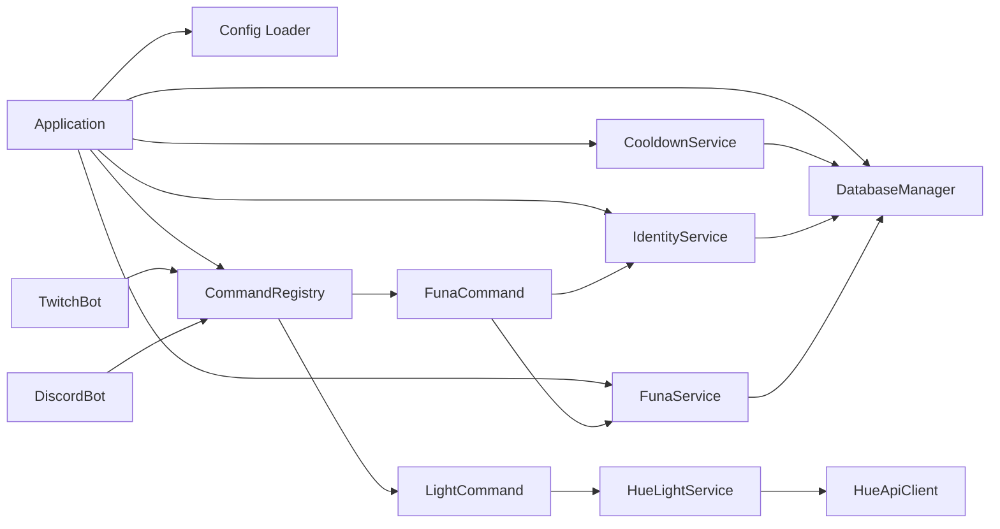

# Arquitectura IO-Bot V2

Este documento describe la arquitectura general del proyecto y la interacción entre sus módulos principales.

## Objetivos de diseño

- Modularidad por subsistema (Twitch, Discord, Hue, Core).
- Reutilización de servicios transversales (identidad, cooldown, base de datos, logging).
- Configuración declarativa y centralizada.
- Evolución incremental por features con bajo acoplamiento.

## Estructura de carpetas

```text
src/
  app/                # Bootstrap y wiring de dependencias
  core/
    commands/         # Registro y ejecución de comandos (middleware)
    config/           # Carga y validación de configuración
    db/               # SQLite y migraciones
    logger/           # Logging estructurado
    services/         # Servicios transversales de dominio
  components/
    twitch/           # Adaptador Twitch y comandos de chat
    discord/          # Adaptador Discord
    hue/              # Cliente/servicio de Philips Hue
  shared/             # Utilidades y errores compartidos
```

## Diagrama de componentes



## Flujo de ejecución de comando

1. Llega mensaje al adaptador de plataforma (ej: Twitch).
2. Se parsea comando + argumentos y se construye contexto.
3. CommandRegistry resuelve el comando registrado.
4. Middleware de cooldown evalúa regla y, si aplica, bloquea o permite.
5. Se ejecuta la lógica del comando.
6. Si corresponde, se registra uso para cooldown.
7. Se retorna mensaje de salida al chat.

## Principios por subsistema

- app: orquesta dependencias, no contiene lógica de negocio.
- core: define contratos transversales y persistencia.
- components: adapta SDKs/APIs externas al dominio interno.
- services: concentra reglas de negocio reutilizables.

## Documentación por subsistema

- `docs/core-subsystems.md`: detalle de subsistemas core (IdentityService, CommandRegistry, FunaService, DB, config).
- `docs/cooldown-system.md`: detalle completo de configuración y flujo de cooldown.

## Mapa de documentación recomendado

- `docs/README.md`: índice principal para navegar documentación.
- `docs/architecture.md`: visión general (este documento).
- `docs/core-subsystems.md`: detalle técnico de la capa core.
- `docs/funa-system.md`: referencia funcional de la feature `!funa`.
- `docs/development/add-command.md`: guía para agregar comandos nuevos.
- `docs/development/best-practices.md`: prácticas y convenciones de implementación.

## Extensión recomendada

Para agregar un nuevo comando o plataforma:

1. Implementar comando en components/<plataforma>/commands.
2. Registrar comando en Application a través de CommandRegistry.
3. Declarar cooldown en config/cooldowns.json si aplica.
4. Agregar tests unitarios y de integración del flujo.
