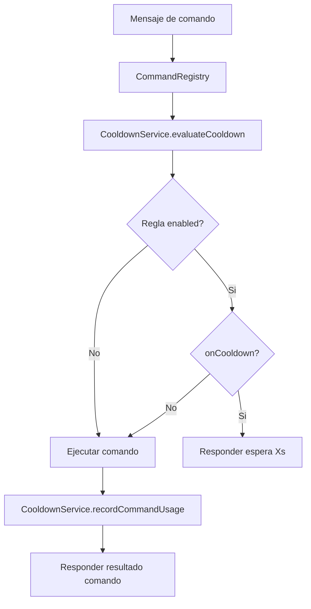

# Subsistema de Cooldown

Este documento describe cómo se configura y funciona el cooldown por comando/plataforma.

## Objetivo

Controlar frecuencia de uso de comandos para evitar spam, con reglas declarativas y scope configurable.

## Configuración

Archivo: config/cooldowns.json

```json
{
  "defaults": {
    "enabled": false,
    "seconds": 5,
    "scope": "user_channel"
  },
  "platforms": {
    "twitch": {
      "funa": {
        "enabled": true,
        "seconds": 8,
        "scope": "user_channel"
      },
      "luz": {
        "enabled": true,
        "seconds": 5,
        "scope": "user_channel"
      }
    },
    "discord": {}
  }
}
```

Variable de entorno asociada:

- COOLDOWN_CONFIG_FILE: ruta del JSON (por defecto config/cooldowns.json).

## Significado de cada campo

- enabled: activa o desactiva cooldown para una regla.
- seconds: duración en segundos.
- scope: estrategia de aislamiento de cooldown.

## Tipos de scope

- user_channel: limita al mismo usuario dentro del mismo canal.
- channel: limita globalmente el comando por canal (cualquier usuario).
- user_global: limita al usuario en toda la plataforma.
- global: limita el comando para toda la plataforma.

## Resolución de regla

1. Buscar regla exacta por plataforma + comando.
2. Si no existe, usar defaults.
3. Si enabled=false, no se aplica cooldown.
4. Si enabled=true, calcular scopeKey y evaluar tiempo restante.

## Diagrama de flujo del middleware



## Construcción del scopeKey

Ejemplos de claves generadas:

- user_channel: twitch:channel:#canal:user:12345
- channel: twitch:channel:#canal
- user_global: twitch:user:12345
- global: twitch:global

## Persistencia

Tabla SQLite: command_cooldowns

Campos relevantes:

- command_name
- scope_key
- last_used_at

Se usa upsert para crear o actualizar el último uso de forma idempotente.

## Pruebas

Suite dedicada:

```bash
npm test -- test/cooldown-system.test.js
```

Cobertura principal:

- cooldown por user_channel.
- cooldown por channel.
- regla desactivada.
- integración con comando de luces.
