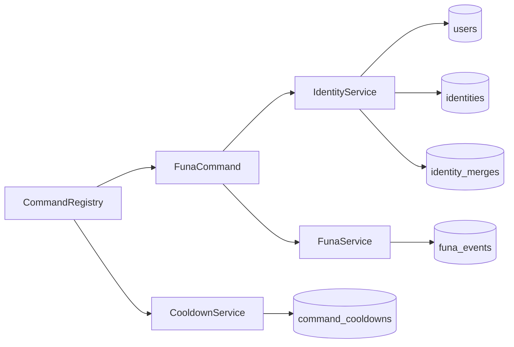
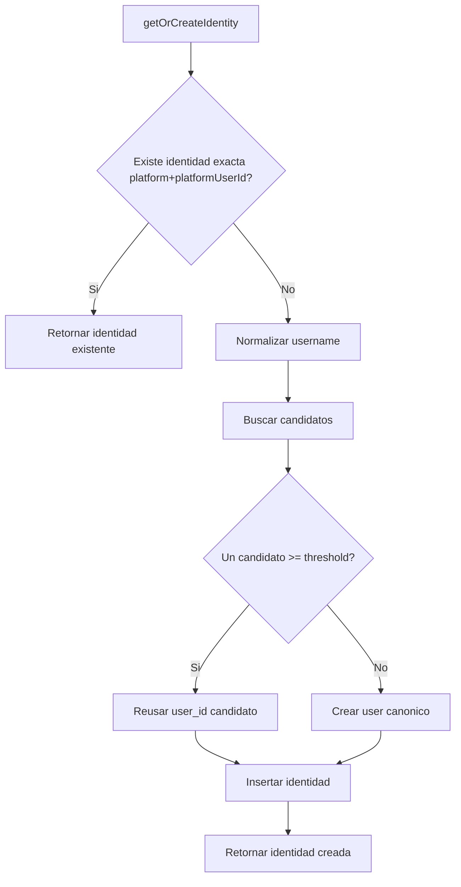

# Core Subsystems

Este documento detalla los subsistemas de la capa core y cómo colaboran entre sí.

## Mapa rápido

- CommandRegistry: resolución de comandos y middleware transversal.
- IdentityService: identidad canónica y matching entre plataformas.
- CooldownService: políticas de frecuencia por plataforma/comando/scope.
- FunaService: persistencia y consulta de eventos de funa.
- Database/Migrations: contrato persistente y evolución de esquema.
- Config Loaders: validación y defaults de configuración.

## Diagrama de relaciones core

## 1) IdentityService

Responsabilidad principal:

- Resolver identidad canónica (`users`) a partir de identidades de plataforma (`identities`).
- Reutilizar usuario existente cuando hay match confiable por similitud.
- Proveer merge manual y trazabilidad de merges.

Funciones clave:

- `getOrCreateIdentity(platform, platformUserId, username, displayName)`.
- `getOrCreateUnresolvedIdentity(platform, username)`.
- `findSimilarUsers(username)`.
- `mergeUsers(sourceUserId, targetUserId, mergedBy, reason)`.

Modelo de matching:

1. Normaliza username (`lowercase`, trim, remove `_.-`, remove dígitos finales).
2. Calcula similitud Levenshtein normalizada en rango 0..1.
3. Si existe exactamente un candidato por encima del umbral (`similarityThreshold`), reusa `user_id`.
4. Si no hay candidato claro, crea usuario canónico nuevo.

Notas de diseño:

- Un username target no visto aún puede registrarse como identidad pendiente con prefijo `unresolved:`.
- El merge manual deja auditoría en `identity_merges`.

### Diagrama del flujo de identidad

## 2) CommandRegistry

Responsabilidad principal:

- Registro de comandos por nombre y alias.
- Punto único de ejecución con middleware de cooldown.

Flujo:

1. Resuelve comando.
2. Evalúa cooldown (`CooldownService.evaluateCooldown`).
3. Si está en cooldown, responde mensaje de bloqueo.
4. Si no, ejecuta comando.
5. Registra uso (`recordCommandUsage`) cuando la regla está activa.

## 3) CooldownService

Responsabilidad principal:

- Resolver reglas declarativas por plataforma/comando.
- Construir `scope_key` según estrategia.
- Persistir y evaluar ventanas de cooldown.

Resumen de scopes:

- `user_channel`
- `channel`
- `user_global`
- `global`

Documentación completa:

- ver `docs/cooldown-system.md`.

## 4) FunaService

Responsabilidad principal:

- Registrar eventos de funa.
- Exponer conteo, historial y estadísticas agregadas.

Capacidades:

- `recordFunaEvent(...)`
- `getFunaCount(targetUserId)`
- `getFunaHistory(targetUserId, limit)`
- `getFunaStats()`

## 5) Database y migraciones

Responsabilidad principal:

- Definir y evolucionar el contrato de datos.
- Ejecutar migraciones en startup.

Tablas core relevantes:

- `users`
- `identities`
- `identity_merges`
- `command_cooldowns`
- `funa_events`

## 6) Configuración core

Loaders relevantes:

- `loadConfig` (env): variables de plataforma y rutas.
- `loadCooldownConfig` (JSON): reglas de cooldown validadas con Zod.

Objetivo:

- fallar temprano ante configuración inválida y aplicar defaults explícitos cuando corresponde.
