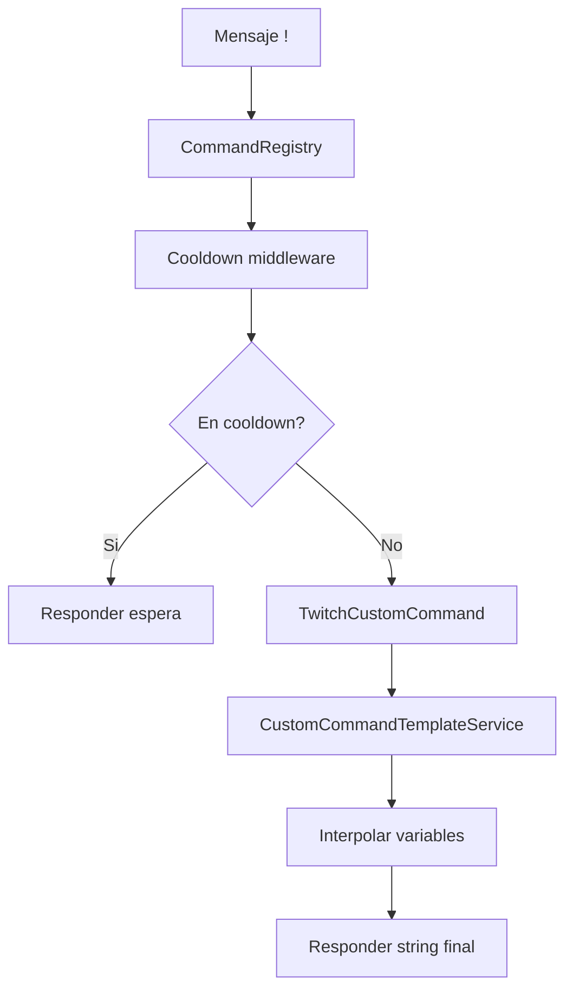

# Sistema de Comandos Custom

Este sistema permite definir comandos simples desde configuración (sin cambiar código), con respuestas dinámicas basadas en variables.

## Objetivo

Replicar comandos estilo StreamElements/Nightbot para casos de respuesta textual con plantillas.

## Configuración

Archivo: `config/custom-commands.json`

```json
{
  "platforms": {
    "twitch": {
      "memide": {
        "enabled": true,
        "response": "/me A $(user) le mide ${random.0-20} cm",
        "cooldown": {
          "enabled": true,
          "seconds": 20,
          "scope": "user_channel"
        }
      },
      "mecabe": {
        "enabled": true,
        "response": "/me A $(user) le caben ${random.0-20} cm"
      },
      "beso": {
        "enabled": true,
        "response": "${user} ha besado a ${random.chatter}. ${random.pick 'Las babas llegaron hasta el stream 💦💦' 'la temperatura está subiendo🥵'}"
      },
      "tortuga": {
        "enabled": true,
        "response": "${random.when 0-20 >10 'sacale un id propio' =0 'se escondio la tortuga' else 'la tortuga sigue chill' }"
      }
    },
    "discord": {}
  }
}
```

Variable de entorno:

- `CUSTOM_COMMANDS_CONFIG_FILE`: ruta del JSON (default: `config/custom-commands.json`).

## Variables soportadas

Sintaxis soportada (ambas):

- `${...}`
- `$(...)`

Variables base:

- `${user}` / `$(user)` → displayName o username de quien ejecuta.
- `${channel}` / `$(channel)` → canal actual.
- `${args}` / `$(args)` → todos los argumentos unidos por espacio.
- `${arg.0}` / `$(arg.0)` → argumento por índice.

Variables random:

- `${random.0-20}` → entero aleatorio inclusive en rango.
- `${random.pick 'a' 'b' 'c'}` → elige una opción al azar.
- `${random.chatter}` → elige chatter reciente del canal (excluye al usuario que ejecuta); si no hay, fallback al usuario actual.
- `${random.when 0-20 >10 'alto' =0 'cero' else 'normal'}` → genera un random en rango y evalúa reglas en orden.

### Sintaxis recomendada para condicionales random

Formato:

```text
${random.when <min>-<max> <op><n> 'mensaje' <op><n> 'mensaje' else 'fallback'}
```

Operadores soportados:

- `>`
- `>=`
- `<`
- `<=`
- `=`
- `!=`

Ejemplo:

```text
${random.when 0-20 >10 'sacale un id propio' =0 'se escondio la tortuga' else 'todo normal'}
```

Tambien puedes usar expresiones dinámicas dentro de cada rama (por ejemplo `random.pick`):

```text
${random.when 0-20 >10 random.pick('msgA', 'msgZ') =0 'msgB' else random.pick 'msgDefault' 'msgDefault2'}
```

## Flujo de ejecución



## Integración con cooldown

Los comandos custom pasan por `CommandRegistry`, así que usan el mismo sistema de cooldown.

Puedes definir cooldown en dos niveles:

1. Global por comando/plataforma en `config/cooldowns.json`.
2. Específico por comando custom dentro de `config/custom-commands.json` en la key `cooldown`.

Precedencia:

- Si el comando custom define `cooldown`, esa regla tiene prioridad.
- Si no define `cooldown`, aplica la regla global de `config/cooldowns.json`.

Ejemplo:

```json
{
  "platforms": {
    "twitch": {
      "memide": { "enabled": true, "seconds": 10, "scope": "user_channel" }
    }
  }
}
```

## Extender variables

Para soportar nuevas variables, extender `CustomCommandTemplateService` agregando nuevas ramas en el evaluador de expresiones.

## Testing

Suites relevantes:

```bash
npm test -- test/custom-command-template.test.js
npm test -- test/custom-commands-config.test.js
npm test -- test/cooldown-system.test.js
```
