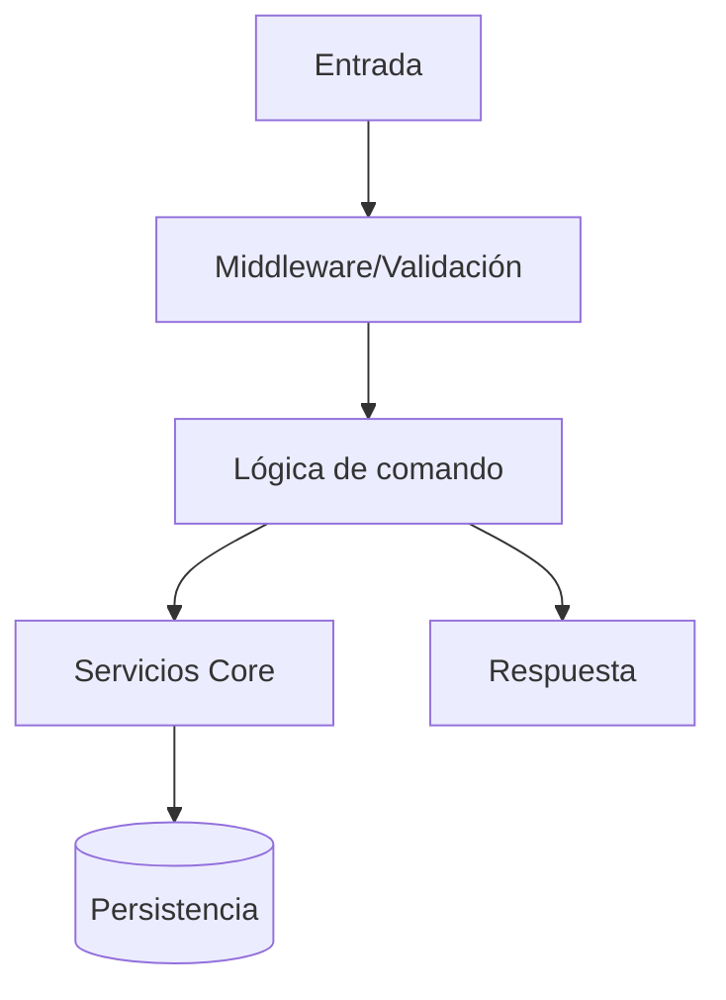

# Template: Documentación de Feature

> Copia este archivo para nuevas features en `docs/<feature>-system.md` y completa cada sección.

## 1. Resumen

- Qué problema resuelve la feature.
- Alcance actual (qué incluye / qué no incluye).

## 2. Quickstart

### Requisitos

- Dependencias mínimas.
- Variables de entorno necesarias.

### Uso básico

```text
!comando <args>
```

Ejemplo:

```text
Usuario: !comando ejemplo
Bot: respuesta esperada
```

## 3. Arquitectura de la feature

- Componentes involucrados.
- Servicios core reutilizados.
- Tablas/recursos persistentes afectados.

### Diagrama (Mermaid)



## 4. Configuración

- Variables de entorno relacionadas.
- Archivos JSON/YAML involucrados.
- Defaults y comportamiento fallback.

## 5. Reglas de negocio

- Validaciones.
- Restricciones/cooldowns/permisos.
- Casos borde relevantes.

## 6. Testing

### Suites

```bash
npm test -- test/<feature>.test.js
```

### Cobertura mínima esperada

- Caso feliz.
- Inputs inválidos.
- Casos borde.
- Integración con servicios/middleware.

## 7. Troubleshooting

Error común 1:

- Causa probable.
- Pasos de resolución.

Error común 2:

- Causa probable.
- Pasos de resolución.

## 8. Roadmap

- Próximos pasos concretos.
- Deuda técnica conocida.

## 9. Referencias

- Archivos clave del workspace.
- Documentos relacionados (arquitectura/core/apis).
