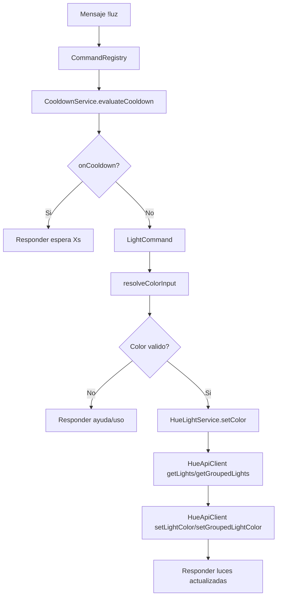

# Sistema de Luz (`!luz`)

Este documento describe el funcionamiento de la feature de control de luces Philips Hue vía comando de chat.

## Resumen

- Comando principal: `!luz <color>`.
- Plataforma actual: Twitch.
- Responsabilidad: traducir un color de entrada a coordenadas XY y aplicarlo a luces/grupos Hue.

## Quickstart

### Requisitos

- Hue Bridge accesible en red local.
- Variables Hue configuradas en `.env`.
- Bot ejecutándose y conectado a Twitch.

### Uso

```text
!luz azul
!luz rojo
!luz #0F336F
```

Respuesta esperada:

```text
Luces actualizadas a azul (#0000FF).
```

## Arquitectura de la feature

Componentes involucrados:

- `LightCommand`: parsea argumento y valida color.
- `color-parser`: normaliza entrada (`nombre`, `hex`, etc.) a color canónico.
- `HueLightService`: selecciona recursos target y aplica color.
- `HueApiClient`: integra con Hue API v2 (`/resource/light`, `/resource/grouped_light`).
- `CommandRegistry`: aplica middleware de cooldown antes de ejecutar.

### Diagrama de flujo



## Configuración

Variables principales:

- `HUE_BRIDGE_IP`
- `HUE_APP_KEY`
- `HUE_LIGHT_IDS` (opcional)
- `HUE_GROUPED_LIGHT_IDS` (opcional)
- `HUE_DEFAULT_BRIGHTNESS`
- `HUE_ALLOW_SELF_SIGNED`

Lógica de selección de targets:

1. Si `HUE_GROUPED_LIGHT_IDS` tiene valores válidos, se aplican esos grupos.
2. Si `HUE_LIGHT_IDS` tiene valores válidos, se aplican esas luces.
3. Si no hay targets explícitos, se aplican todas las luces individuales detectadas.
4. Si no hay recursos o no hay coincidencias con IDs configurados, se retorna error.

## Cooldown

El comando `luz` usa cooldown configurable en `config/cooldowns.json`.

Ejemplo:

```json
{
  "platforms": {
    "twitch": {
      "luz": {
        "enabled": true,
        "seconds": 5,
        "scope": "user_channel"
      }
    }
  }
}
```

## Testing

Suite principal relacionada:

```bash
npm test -- test/hue-light-service.test.js
npm test -- test/cooldown-system.test.js
```

Cobertura actual:

- Aplicación por `grouped_light` cuando está configurado.
- Fallback a luces individuales cuando no hay targets explícitos.
- Integración de cooldown vía `CommandRegistry` (suite de cooldown).

## Troubleshooting

Error: `Color invalido`

- Verifica formato (`nombre conocido` o `#RRGGBB`).
- Revisa el parser de color en `src/shared/colors`.

Error: `No hay recursos disponibles en Hue`

- Revisa conectividad con bridge e `HUE_APP_KEY`.
- Confirma que existen luces o grupos en el bridge.

Error: `Ninguna luz o grupo coincide con HUE_LIGHT_IDS o HUE_GROUPED_LIGHT_IDS`

- Verifica que los IDs configurados existan en el bridge.
- Si dudas, vacía esos campos para usar descubrimiento automático de luces.

## Archivos clave

- `src/components/twitch/commands/LightCommand.js`
- `src/components/hue/HueLightService.js`
- `src/components/hue/HueApiClient.js`
- `src/shared/colors/color-parser.js`
- `test/hue-light-service.test.js`
